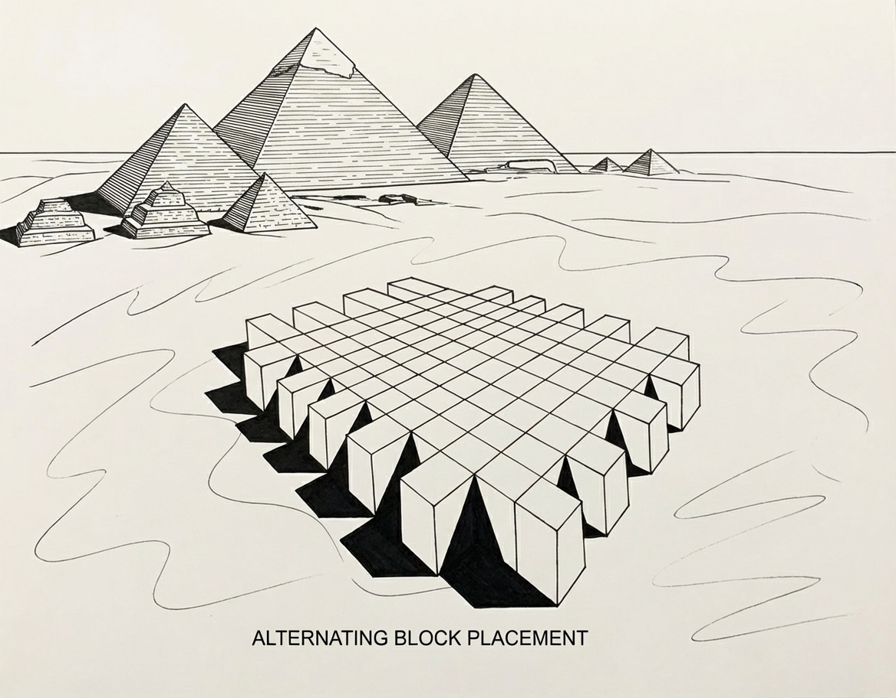
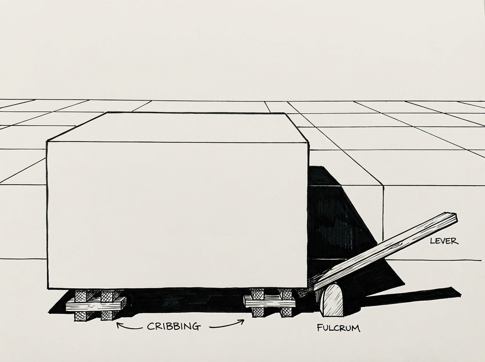
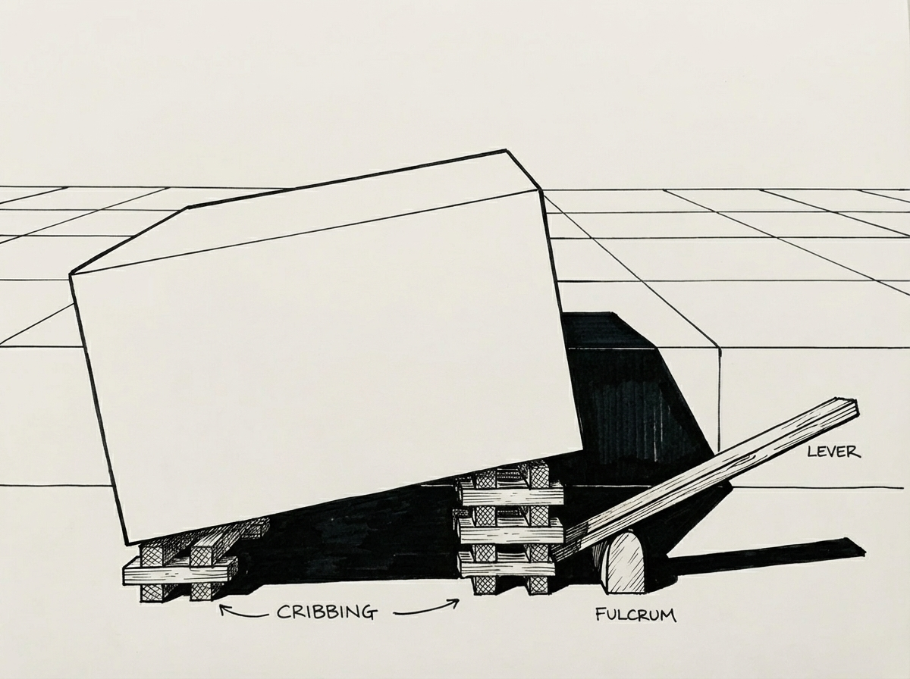

# Executive Summary

This document presents a conceptual construction framework for Old Kingdom Egyptian pyramid construction based on incremental mastaba stacking. The framework proposes repeatable labor units, simple mechanical principles, and large-scale workforce parallelization as the foundation for pyramid construction. The central innovation is an alternating block placement strategy that enables cribbing access while maintaining structural integrity.

**Disclosure**: The author developed the core conceptual hypothesis and construction framework presented in this paper. An AI language model (Claude, Anthropic) was used as an editorial and drafting aid to assist with organization, language refinement, synthesis of background material, and presentation of supporting context under the author’s direction. All historical interpretations, reference selection, factual verification, and conclusions were reviewed and validated by the author, who takes full responsibility for the content.

**Nature of this work**: This is a *conceptual construction framework* rather than a fully developed archaeological hypothesis. Several components require engineering validation, experimental archaeology, and archaeological testing before the framework can be considered a complete theory.

**Key testable predictions**: The framework generates specific archaeological expectations regarding block placement patterns, wear signatures, and staging debris that distinguish it from alternative proposals.

---

# 1. Introduction and Scope

## 1.1 The Central Problem

The construction of Egypt's Old Kingdom pyramids, particularly the Great Pyramid of Khufu (c. 2580-2560 BCE), presents a fundamental engineering challenge: moving and elevating approximately 2.3 million stone blocks averaging 2.5 tonnes to a height of 146.6 meters using only Bronze Age technology. Despite decades of research, no consensus explanation exists for the vertical transport mechanism at the required industrial scale.

## 1.2 Framework Positioning

This framework addresses core construction mechanics for standard limestone blocks forming the pyramid interior. It explicitly does not yet provide complete solutions for:

- Granite beams exceeding 40 tonnes (King's Chamber roof)
- Casing stone integration sequences
- Precision maintenance protocols across 200+ levels
- Internal chamber construction coordination

These limitations are acknowledged upfront and addressed in dedicated sections.

## 1.3 Historical Context: The Old Kingdom

### Timeline of Major Pyramid Construction

**Third Dynasty (c. 2686-2613 BCE)**

The Step Pyramid of Djoser at Saqqara (c. 2670 BCE) marks the beginning of monumental stone architecture. Designed by Imhotep, this structure demonstrated the mastaba-stacking concept by layering six progressively smaller mastabas.

**Fourth Dynasty (2613-2494 BCE): Peak Construction Period**

- **Sneferu** (2613-2589 BCE): Built the Meidum Pyramid, Bent Pyramid, and Red Pyramid, using more stone than any other pharaoh
- **Khufu** (2589-2566 BCE): Built the Great Pyramid of Giza (c. 2580-2560 BCE), originally 146.6 meters tall with approximately 2.3 million blocks
- **Khafre** (2558-2532 BCE): Built the second Giza pyramid (c. 2570-2520 BCE) and the Great Sphinx
- **Menkaure** (2532-2503 BCE): Built the third Giza pyramid (c. 2510-2490 BCE), approximately 65 meters tall

The Giza pyramids were constructed over approximately 85 years (2589-2504 BCE).

### Construction Duration Estimates

Ancient historian Herodotus (c. 449 BCE) stated the Great Pyramid required 100,000 workers over 20 years. Modern estimates range from 15-30 years, with 20 years remaining the most commonly cited timeframe. This framework uses 20 years as the baseline for production rate calculations while acknowledging the uncertainty range.

## 1.4 Key Architectural Terms

**Mastaba**: A flat-roofed, rectangular structure with inward sloping sides, serving as the precursor to pyramids. In ancient Egyptian: "pr-djed" (house of eternity). The Step Pyramid of Djoser demonstrates the evolutionary link—six mastabas of decreasing size stacked vertically.

<!-- {#fig:fig1} -->
<!--  -->

**Cribbing**: Incremental lifting technique using wooden supports (cribs) and levers. After each small lift, wooden blocks support the object at the new height.

**Casing Stones**: Smooth, polished outer layer, typically fine Tura limestone. Originally covered entire pyramid surfaces, creating a gleaming appearance. Most removed over millennia.

---

\newpage

# 2. Existing Theories and Unresolved Constraints

## 2.1 External Ramp Theory

### The Proposal
Workers hauled blocks up external ramps built alongside the pyramid, extended and raised as construction progressed.

### Geometric Constraints
- Linear ramp at 8% gradient requires ~1.8 km length to reach 146m apex
- Ramp volume approaches pyramid volume
- Giza Plateau lacks sufficient space
- No archaeological evidence of ramp remnants at this scale

### Spiral Ramp Variant
Mark Lehner proposed spiral ramps wrapping around the pyramid exterior. Challenges include increasingly tight corners, obstructed corner visibility for alignment, and structural concerns with narrowing support base.

## 2.2 Internal Ramp Theory (Houdin)

### The Proposal
Jean-Pierre Houdin proposes internal ramps spiraling within the pyramid structure:
- Bottom third via external ramps (up to ~43m)
- Upper two-thirds via internal spiral ramps (~7% gradient)
- Corner notches with wooden cranes for 90-degree turns
- Ramps remain embedded within finished pyramid

### Supporting Evidence
- 1980s microgravimetric survey detected spiral-pattern density variations
- Northeast corner notch visible at ~82m height
- 2017 ScanPyramids "Big Void" detected via muon radiography

### Critical Assessment
The theory faces skepticism regarding the required pre-planning complexity and coordination with internal chambers. No definitive internal ramp has been confirmed through non-invasive scanning.

## 2.3 Experimental Archaeology Results

### NOVA 1992 Experiment (Lehner & Hopkins)
- Scale: 6m high × 9m wide pyramid (~405 tons)
- 186 stones averaging 2.2 tonnes
- Finding: Copper tools adequate but required constant resharpening

### Levering Experiments
- Isler (1985, 1992): Achieved one tier lift in ~1.5 hours using wooden levers and cribbing
- Keable: Lifted blocks using manufactured concrete shims in ~2 minutes
- Hussey-Pailos (2005): Simple levering device lifted 1,100kg block one course in under 1 minute

These experiments demonstrated mechanical feasibility at small scale but did not address industrial-scale continuous operation.

### Water Lubrication (Bonn et al. 2014)
Optimal sand moisture (~5% water content) reduced friction coefficient by nearly 50%. Effect requires precise moisture balance. Applies to horizontal transport over sand surfaces.

## 2.4 Unresolved Constraints

Despite experimental validation of individual techniques, no theory has successfully addressed:

1. **Industrial scaling**: Continuous operation over 20 years with millions of blocks
2. **Vertical transport mechanism**: Moving blocks 146m vertically without impractical ramps
3. **Precision maintenance**: Maintaining accuracy (base level within 2cm over 230m) across parallel operations
4. **Exceptional elements**: 40+ tonne granite beams requiring fundamentally different handling
5. **Archaeological footprint**: Limited physical remains of construction infrastructure

---

# 3. Core Framework Principles

This framework proposes five foundational principles:

1. **Block standardization**: Core blocks averaging 2.5 tonnes enable standardized handling procedures
2. **Mastaba-step construction**: Building proceeds as stacked mastabas forming a stepped pyramid core
3. **Incremental vertical lifting**: Cribbing with wooden levers and support stacks achieves vertical transport
4. **Horizontal transport dominance**: Sled-based sliding on prepared surfaces handles positioning
5. **Massive parallelization**: Thousands of workers operate on independent, simultaneous tasks across multiple levels

**Scope limitation**: This framework applies to **perimeter blocks** forming the outer edges of each mastaba level. Core blocks (interior fill) may be handled with simplified procedures and do not require the alternating placement strategy described below.

---

# 4. The Alternating Block Strategy

## 4.1 The Geometric Access Problem

If perimeter blocks were placed continuously around an entire mastaba level, workers would lack access to perform cribbing operations on the inner face (against the existing platform below). This geometric constraint requires a staged approach.

## 4.2 Proposed Solution: Phased Placement

**Phase 1 - Initial Staging:**
- Perimeter blocks positioned in **alternating pattern** around mastaba edge
- Every other position remains empty during initial placement
- Gap width: 1.5-2 meters (~1.5 block widths)
- Creates access corridors on both sides of each staged block

{width=50%}  
  
**Phase 2 - Cribbing and Lifting:**
- Workers access both front and back of each staged block through gaps
- Blocks lifted incrementally using levers and cribbing stacks
- Once lifted to target height (~0.7m), blocks remain supported on cribs

{width=50%}
{width=50%}
  
**Phase 3 - Sled Transfer and Sliding:**
- Lifted blocks transferred onto wooden sleds
- Sleds slide horizontally inward onto mastaba surface
- Blocks positioned over final locations and lowered

**Phase 4 - Gap Filling:**
- Process repeats for previously empty positions
- Adjacent blocks now moved inward, providing access
- Mastaba level becomes structurally complete

**Core blocks**: Interior blocks may be placed with simplified direct handling, as they do not face the same access constraints as perimeter blocks.

## 4.3 Structural Stability During Partial Completion

**Concern**: Alternating gaps introduce asymmetric loading around the perimeter.

**Mitigations**:  
- Gaps filled progressively (not left open indefinitely)  
- Typical cycle time of 1-2 days per position minimizes exposure  
- Interior core blocks provide central mass stability  
- Perimeter blocks represent ~15-20% of total level mass  
  
**Required validation**: Finite element analysis of partially completed mastaba levels under asymmetric loading. This represents a critical engineering validation requirement.  

## 4.4 Predicted Archaeological Signatures

**If this framework is correct, the following should be archaeologically detectable:**

1. **Block face wear patterns**: Distinctive abrasion on inner faces (against previous level) vs. outer faces (exposed during staging)
2. **Tool mark distributions**: Concentration of lever marks on block edges accessible during alternating placement
3. **Staging debris**: Accumulated wood fragments, rope remnants, and stone chips in predictable positions around perimeter
4. **Surface wear on completed levels**: Concentrated trackway wear patterns from repeated sled paths
5. **Block placement tolerances**: Alternating placement predicts specific error patterns in block positioning

**Archaeological test**: Detailed examination of exposed core blocks in damaged pyramid sections should reveal these signatures if the framework is correct.

---

# 5. Cribbing and Levering Mechanics

## 5.1 The Incremental Lift Process

Vertical transport achieved through repeated small lifts:

1. **Initial lift**: Wooden levers (3-4m long) inserted under block edge
2. **Mechanical advantage**: Fulcrum placed close to block, creating 8:1 to 12:1 leverage
3. **Team effort**: 4-6 workers per lever apply downward force
4. **Crib insertion**: Wooden blocks inserted into lifted gap (5-10cm per cycle)
5. **Repositioning**: Levers moved to opposite side, process repeated
6. **Iteration**: Cycle continues until block reaches target height (~0.7m per mastaba level)

## 5.2 Labor Estimates with Uncertainty Ranges

**Experimental basis**: Isler's experiments (1.5 hours per tier), Keable's experiments (~2 minutes), Hussey-Pailos experiments (<1 minute). These represent isolated demonstrations under optimal conditions, not continuous industrial operation.

**Scaling adjustments required**:  
- Worker fatigue over extended shifts  
- Wood failure and replacement cycles  
- Crib repositioning and safety protocols  
- Coordination delays between teams  
  
### Time Per Block Estimates

**Optimistic scenario** (based directly on experiments):  
- 7-10 cycles at 20-30 minutes each  
- Total time: 3-5 hours per block  
- Assumes optimal conditions, experienced crews, minimal delays  

**Conservative scenario** (accounting for industrial-scale factors):  
- 7-10 cycles at 45-60 minutes each  
- Total time: 6-10 hours per block  
- Includes fatigue, equipment maintenance, coordination overhead  
  
**Workers per operation**: 10-15 (lever operators, crib handlers, safety monitors, material runners)  
  
**Critical uncertainty**: The true time-per-block in continuous industrial operation remains unknown. Experimental archaeology at scale over extended periods is required for validation.  

## 5.3 Mechanical Validation Requirements

**Priority engineering analyses needed:**

1. **Lever loading analysis**: Maximum safe load per wooden lever as function of species, length, diameter, and fulcrum position
2. **Crib stack stability**: Load distribution under asymmetric lifting, failure modes, safety factors
3. **Fatigue modeling**: Worker performance degradation over 10-hour shifts, optimal rotation schedules
4. **Wood consumption**: Replacement rates for levers and cribs under continuous use

These analyses are essential for converting this framework into a validated theory.

---

# 6. Horizontal Transport and Surface Preparation

## 6.1 Sled Transport Mechanics

Once blocks reach mastaba height, horizontal movement occurs via:

- **Wooden sleds**: Blocks placed on hardwood runners
- **Surface preparation**: Mastaba surfaces treated with water or mud for lubrication
- **Team size**: 10-15 workers per 2.5-tonne block on wetted surface (based on Bonn et al. 2014 friction coefficients)
- **Distance**: As much as half the width of the pyramid for the central blocks  

## 6.2 Surface Wear Management

**Problem**: Repeated sled passes across limestone surfaces risk cumulative damage.

**Proposed mitigations:**  
- **Sacrificial wooden trackways**: Temporary paths laid atop completed surfaces, replaced as needed  
- **Concentrated traffic patterns**: Designated pathways limit wear to specific zones  
- **Systematic wetting**: Reduces stone-on-stone friction and wear  
- **Progressive casing**: Lower-level casing stones may have been placed during upper construction, protecting underlying surfaces  
  
**Archaeological prediction**: Interior pyramid stones should show concentrated wear patterns along trackway routes if this framework is correct.  

**Required validation**: Experimental archaeology measuring wear rates on limestone under repeated sled passage with various mitigation strategies.  

---

# 7. Step-by-Step Construction Sequence

## 7.1 Foundation Preparation

1. **Bedrock leveling**: Using water-filled trenches (documented Egyptian technique)
2. **Water leveling**: Interconnected trenches filled to establish horizontal datum
3. **Baseline establishment**: Trenches drained, level surface verified to within 2cm over 230m
4. **Reference markers**: Permanent corner markers and alignment references established

## 7.2 Mastaba Levels 1 Through ~200

For each level (n = 1, 2, ..., ~200):

1. **Perimeter block staging**: Alternating blocks positioned around edge of level (n-1)
2. **Cribbing and lifting**: First set lifted to height using lever-and-crib method
3. **Sled transfer**: Blocks moved onto sleds and slid horizontally inward
4. **Positioning and lowering**: Blocks placed at final locations and lowered
5. **Gap filling**: Repeat for previously empty positions to complete perimeter
6. **Core filling**: Interior blocks placed using simplified direct methods
7. **Level verification**: Horizontal level checked using water channels or plumb lines
8. **Reference maintenance**: Corner plumb lines and alignment markers verified

## 7.3 Apex Region

- Final 10-15 levels too small for full alternating strategy
- Simplified direct placement likely used
- Apex stone (pyramidion) placed ceremonially

---

# 8. Workforce Organization and Production Requirements

## 8.1 Production Rate Calculations

**Constants:**  
- Total blocks: 2.3 million  
- Construction timeframe: 20 years (±5 years uncertainty)  
- Working days per year: 300 (allowing for flood season)  
- Total working days: 6,000  
  
**Required production rate:**  
- **383 blocks per day** (baseline scenario)  
- **38 blocks per hour** (10-hour workday)  
  
**Sensitivity analysis:**  

| Construction Duration | Days/Year | Blocks/Day | Blocks/Hour |
|----------------------|-----------|------------|-------------|
| 15 years (optimistic) | 300 | 511 | 51 |
| 20 years (baseline) | 300 | 383 | 38 |
| 25 years (conservative) | 300 | 307 | 31 |

## 8.2 Workforce Distribution

**Estimated total workforce: 10,000-12,000**

| Category | Workers | Percentage | Function |
|----------|---------|------------|----------|
| Quarrying & shaping | 2,500 | 21% | Extracting and preparing blocks |
| Transport teams | 2,000 | 17% | Moving blocks from quarry to pyramid |
| Cribbing & lifting crews | 1,500 | 13% | Vertical lifting operations |
| Placement & positioning | 700 | 6% | Final block placement and alignment |
| Surface preparation | 800 | 7% | Trackway maintenance, wetting |
| Tool maintenance | 1,000 | 8% | Sharpening, repair, fabrication |
| Logistics & supervision | 1,300 | 11% | Coordination, supply, management |
| Support services | 1,200 | 10% | Food, water, medical, housing |
| Surveying & quality control | 500 | 4% | Precision maintenance, verification |
| Contingency & rotation | 500 | 4% | Buffer for absences, specialized tasks |
| **TOTAL** | **12,000** | **100%** | |

**Archaeological validation**: Worker village remains at Giza confirm 10,000-20,000 scale workforce with evidence of organized food distribution, medical care, and housing consistent with this distribution.

## 8.3 Parallelization Across Levels

**Critical advantage**: Multiple mastaba levels active simultaneously.

At peak construction (pyramid mid-height):  
- **Lower levels** (n to n-5): Receiving newly quarried blocks, initial staging  
- **Middle levels** (n-5 to n-15): Active cribbing and lifting operations  
- **Upper levels** (n-15 to n-20): Final positioning, quality verification  
  
**Result**: 10-20 mastaba levels operate simultaneously, distributing workforce across independent workspaces and enabling required production rates.  
  
---

# 9. Precision Maintenance: The Critical Challenge

## 9.1 The Precision Problem

The Great Pyramid's foundation is level to within 2cm over 230m. Maintaining this precision across 200+ levels with thousands of parallel workers represents a major challenge for any construction theory.

## 9.2 Framework Components

### Global Reference Frame

**Foundation baseline**: Water-leveling technique establishes initial horizontal datum (well-documented).

**Vertical references**:  
- **Corner plumb lines**: Weighted lines suspended from fixed points, maintained throughout construction  
- **Intermediate stations**: Reference markers at regular intervals around perimeter  
- **Sighting lines**: Optical alignment between reference points  
  
### Local Placement Tolerance  
  
**Distinction**: Global precision (overall pyramid geometry) differs from local tolerance (individual block placement).  
  
**Proposed hierarchy**:  
1. **Corner blocks**: Placed with highest precision using direct reference to plumb lines (±1-2cm)  
2. **Perimeter blocks**: Intermediate precision, guided by corner positions (±2-3cm)  
3. **Core blocks**: Relaxed tolerance acceptable for structural fill (±5-10cm)  
  
## 9.3 Error Propagation Modeling  
  
**Required analysis** (not yet completed):  
- Mathematical modeling of cumulative error across 200 levels  
- Sensitivity to individual block placement tolerance  
- Correction protocols and their effectiveness  
- Survey team capabilities with available tools  
  
**Archaeological expectations**:  
If this precision framework is correct, evidence should include:  
- Surveying marks on specific blocks (corners, references)  
- Systematic accuracy gradients (corners more precise than fill)  
- Correction adjustments visible in block placement patterns  
  
## 9.4 Critical Knowledge Gap

This framework does not yet provide a complete mechanism for precision maintenance. While the components above are necessary, their sufficiency remains undemonstrated. This represents a priority area for further development, particularly through:

- Detailed analysis of Egyptian surveying tool capabilities  
- Error propagation modeling  
- Archaeological examination of exposed internal blocks for placement accuracy patterns  

---

# 10. Special Cases and Unresolved Problems

## 10.1 Casing Stone Integration

**Archaeological evidence**: Unfinished pyramids (e.g., Seila pyramid) show casing stones placed during construction, not afterward.

**Proposed sequence**:  
- Casing stones placed progressively, 5-10 levels behind core construction  
- Provides working surface protection for subsequent operations  
- Allows simultaneous core and casing work at different heights  
- Final polishing performed after pyramid completion  
  
**Archaeological prediction**: Staging marks and unfinished surfaces on lower casing blocks should show evidence of subsequent traffic if this sequence is correct.  
  
## 10.2 Internal Chambers and Passages  
  
**Integration approach**:  
- Chambers built when construction reaches appropriate height  
- Corbelled ceilings (Grand Gallery) constructed in stages as levels rise  
- Passages formed by omitting blocks in predetermined positions  
- Requires careful coordination between survey teams and placement crews  
  
**Coordination challenge**: Internal architecture must be precisely positioned relative to external geometry, requiring sophisticated planning and execution.  

## 10.3 Granite Beams: The Central Unsolved Problem

### The Challenge

The King's Chamber roof contains 9 granite beams, each estimated at 40-50 tonnes. These cannot be handled via the 2.5-tonne block methodology described above.

### Why This Is Critical

This is not a peripheral detail but a **structurally central element**. The King's Chamber represents a major architectural feature, and any complete theory must account for its construction. Deferring this problem risks undermining the framework's applicability.

### Bounded Set of Plausible Mechanisms

**Option 1: Dedicated Internal Ramps**  
- Temporary ramps built within pyramid structure specifically for massive elements  
- Removed or filled after use  
- Concern: Converges toward Houdin's internal ramp theory without clear differentiation  
  
**Option 2: Pre-Positioning Strategy**  
- Massive elements placed early in construction when ground-level access available  
- Pyramid built around pre-positioned beams  
- Concern: Requires extraordinary pre-planning and risks construction sequence conflicts  
  
**Option 3: Counterweight System**  
- Large stone counterweights on lever systems  
- Mechanical advantage sufficient for 40+ tonne loads  
- Concern: No archaeological evidence for infrastructure of required scale  
  
**Option 4: Expanded Team Scale**  
- Dramatically larger teams (100-200 workers) using conventional cribbing  
- Proportionally larger levers and crib structures  
- Concern: Spatial constraints and coordination complexity  

### Why This Does Not Invalidate the Core Framework

The granite beam problem affects a small number of exceptional elements. The framework's core contribution—alternating placement strategy for standard blocks—remains valid for the 99%+ of pyramid mass consisting of 2-3 tonne blocks. However, a complete theory requires a specific mechanism for exceptional elements.

**Priority research direction**: Dedicated study combining mechanical engineering analysis, experimental archaeology with multi-tonne elements, and archaeological examination of King's Chamber construction context.

---

# 11. Archaeological Expectations and Testable Predictions

## 11.1 Theory Testing Requirements

A theory becomes scientific when it generates predictions that distinguish it from alternatives. This framework predicts specific archaeological signatures.

## 11.2 Predicted Observable Patterns

### Block Wear Signatures  
**Prediction**: Perimeter blocks should show distinctive wear patterns:  
- Inner faces (against previous level): Abrasion from initial placement and cribbing  
- Outer faces: Exposure wear from staging period  
- Pattern should differ from continuous-placement theories  
  
**Test**: Detailed examination of exposed core blocks in pyramid breach areas  
  
### Tool Mark Distributions
**Prediction**: Lever marks concentrated on block edges accessible during alternating placement phase  
**Test**: Systematic documentation of tool marks on interior blocks  

### Staging Debris Patterns  
**Prediction**: Accumulated construction debris (wood fragments, rope, stone chips) in predictable perimeter positions  
**Test**: Archaeological excavation of pyramid base periphery  

### Surface Trackway Wear  
**Prediction**: Concentrated linear wear on interior surfaces corresponding to sled pathways  
**Test**: Examination of exposed interior surfaces for wear gradients  

### Precision Gradients  
**Prediction**: Systematic accuracy gradients with corners > perimeter > core  
**Test**: Precision survey of exposed block placement in damaged sections  

## 11.3 Negative Evidence

**What has NOT been found** is equally important:

- No massive external ramp remnants at Giza
- No clear internal ramp structures confirmed via scanning
- Limited evidence of wheeled devices or pulley systems
- No evidence of hydraulic infrastructure

This framework is consistent with these absences.

\newpage

## 11.4 Distinguishing from Alternative Theories

| Observable | External Ramp | Internal Ramp (Houdin) | This Framework |
|-----------|---------------|----------------------|----------------|
| Large ramp remnants | Expected | Not expected | Not expected |
| Internal spiral void | Not expected | Expected | Not expected |
| Alternating wear patterns | Not expected | Not expected | **Expected** |
| Perimeter staging debris | Not expected | Limited | **Expected** |
| Trackway surface wear | Limited | Limited | **Expected** |

---

# 12. Comparison with Alternative Theories

## 12.1 External Ramp Approaches

**Constraint**: Linear ramp reaching 146m requires ~1.8km length and volume approaching pyramid volume.

**Framework advantage**: No external ramps required; vertical transport achieved through incremental cribbing.

## 12.2 Spiral Ramp Variants

**Constraint**: Corner turning with heavy blocks extremely difficult; ramp increasingly narrow at height.

**Framework advantage**: Primarily horizontal movement on stable, wide mastaba surfaces.

## 12.3 Internal Ramp Theory (Houdin)

**Difference**: Houdin proposes spiral ramps embedded within pyramid structure.

**Framework distinction**:
- Uses external, observable construction sequence
- Does not require pre-planned internal void spaces
- Compatible with internal chamber placement without structural conflicts

**Potential convergence**: Granite beam handling may require internal ramp elements, suggesting possible hybrid approach.

---

# 13. Limitations and Research Priorities

## 13.1 Current Framework Status

**What this framework provides:**  
- Mechanically plausible core construction sequence  
- Specific testable archaeological predictions  
- Realistic workforce and production rate framework  
- Novel solution to perimeter access geometry  
  
**What requires further development:**  
- Complete granite beam handling mechanism  
- Precision maintenance validation through error modeling  
- Casing stone integration details and timing  
- Archaeological validation of predicted signatures  
  
## 13.2 Priority Research Directions

### Tier 1 (Critical for framework validity)
1. **Mechanical engineering analysis**: Detailed lever loading, crib stability, worker fatigue modeling
2. **Error propagation modeling**: Quantitative precision maintenance analysis
3. **Granite beam mechanism**: Specific proposal with engineering validation
4. **Archaeological survey**: Systematic search for predicted wear and debris patterns

### Tier 2 (Important for completeness)
5. **Experimental archaeology at scale**: Multi-month operations testing continuous cribbing cycles
6. **Casing integration sequence**: Detailed construction order modeling
7. **Internal chamber coordination**: Precise survey alignment requirements
8. **Workforce logistics**: Detailed organizational modeling including food, water, tool supply

### Tier 3 (Refinement)
9. **Seasonal variation modeling**: Nile flood impacts on construction schedule
10. **Regional variation analysis**: Application to other Old Kingdom pyramids
11. **Tool technology timeline**: Copper vs. early bronze capabilities
12. **Social organization**: Labor recruitment and management systems

---

# 14. Conclusion

This framework proposes that Old Kingdom pyramids were constructed through incremental mastaba stacking, with vertical transport achieved via lever-and-crib methods and massive workforce parallelization across simultaneous construction levels. The alternating block placement strategy would provide, if validated a novel solution to the geometric access problem inherent in perimeter construction.

**What distinguishes this framework:**

1. **Avoids geometric impossibilities** of massive external ramps
2. **Generates specific testable predictions** distinguishing it from alternatives
3. **Could achieve required production rates** through realistic parallelization
4. **Uses only documented ancient techniques** (water leveling, cribbing, sled transport)
5. **Explicitly identifies unsolved problems** rather than claiming completeness

**The granite beam problem** remains the most significant unresolved challenge. While this does not invalidate the framework for the 99%+ of pyramid mass consisting of standard blocks, a complete theory requires a specific mechanism for exceptional elements.

**From working hypothesis to validated theory:**

This framework requires:  
- Engineering validation of mechanical assumptions  
- Experimental archaeology at industrial scale  
- Archaeological testing of predicted signatures  
- Specific resolution of granite beam handling  

The framework reframes pyramids not as inexplicable engineering marvels, but as the result of disciplined repetition of simple mechanical actions, multiplied across thousands of workers and many years. The sophistication lies in organizational capacity and systematic execution rather than advanced lost technology.

**Next steps**: Engagement with archaeological and engineering communities to test predictions, refine mechanisms, and develop the framework into a fully validated construction theory.

---

# References

## Primary Archaeological Sources
- Arnold, D. (1991). *Building in Egypt: Pharaonic Stone Masonry*. Oxford University Press.
- Lehner, M. (1997). *The Complete Pyramids*. Thames & Hudson.
- Lehner, M. & Hawass, Z. (2017). *Giza and the Pyramids: The Definitive Story*. University of Chicago Press.
- Clarke, S. & Engelbach, R. (1990). *Ancient Egyptian Construction and Architecture*. Dover Publications.

## Experimental Archaeology
- Stocks, D.A. (2003). *Experiments in Egyptian Archaeology: Stoneworking Technology in Ancient Egypt*. Routledge.
- Bonn, D., et al. (2014). "Sliding Friction on Wet and Dry Sand." *Physical Review Letters*, 112, 175502.
- Isler, M. (1985). "On Pyramid Building." *Journal of the American Research Center in Egypt*, 22, 129-142.
- Isler, M. (1992). "On Pyramid Building II." *Journal of the American Research Center in Egypt*, 29, 151-163.

## Alternative Theories
- Houdin, J.P. & Brier, B. (2008). *The Secret of the Great Pyramid*. Smithsonian Books.
- Smith, C.S. (2018). *How the Great Pyramid Was Built*. Smithsonian Books.

## Organizational and Social Context
- Kemp, B. (2018). *Ancient Egypt: Anatomy of a Civilization*, 3rd edition. Routledge.

## Recent Technical Developments
- Morishima, K. et al. (2017). "Discovery of a big void in Khufu's Pyramid by observation of cosmic-ray muons." *Nature*, 552, 386-390.